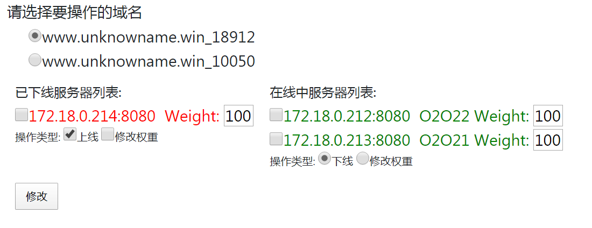

# Ops Tools

基于阿里云的`SDK`包，用于快速处理一些故障

## 功能

- 快速修改DNS的A记录(只支持标准版，企业版的智能解析只支持修改默认记录)
- 阿里云`SLB`后端服务器上/下线
- `NGINX`后端主机上/下线

    

## QuickStart

## 1. `Clone`代码

```bash
git clone https://github.com/UnknowName/aliops.git
```
## 2. 创建一个公钥，并将公钥传送至网关服务器上

```bash
ssh-keygen
ssh-copy-id root@IP
```

## 3. 准备一个配置文件

```bash
cd aliops
cp src/config.yml config.yml 
```

## 4. 启动
```bash
docker-compose up -d
```

# Config.yml
```yaml
domains:
  # 需要管理的域名显示名称
  - www.unknowname.win_18912:
      # 该域名的所在域,用于修改DNS时需要,如果没该需求,可以不填
      domain: unknowname.win
      # 域名NGINX服务器,如果不写,使用全局的NGINX
      nginx:
        ssh_user: username
        hosts:
          - 128.0.255.2
          - 128.0.255.3
      # 代码的后端服务器的端口,如果不填写.NGINX页面不显示
      backend_port: 8080
      # NGINX代理该域名的后端配置文件
      config_file: /etc/nginx/conf.d/dev.siss.io.conf
      # 该域名的SLB ID,不是必须项,如果要使用SLB上/下线功能,填写.不填写SLB页面不显示
      slbs:
        - lb-wz9d9j05rzlyok300fcf4
      ips:
        # DNS修改功能,不写DNS页面不显示
        - 120.77.199.116

  - www.unknowname.win_10050:
      # for change dns record
      domain: unknowname.win
      # for nginx
      config_file: /etc/nginx/conf.d/www.unknowname.win.conf
      backend_port: 80
      slbs:
        - lb-wz9obyqmiidllwulomjxh 
      ips:
        - 128.0.255.10
# 全局NGINX
nginx:
  ssh_user: username
  hosts:
    - 128.0.255.12
    - 128.0.255.13

api:
  aeskey: key
  aeskey_secret: secret
  region: cn-shenzhen

dns_api:
  aeskey: ""
  aeskey_secret: ""
  region: cn-shenzhen
```